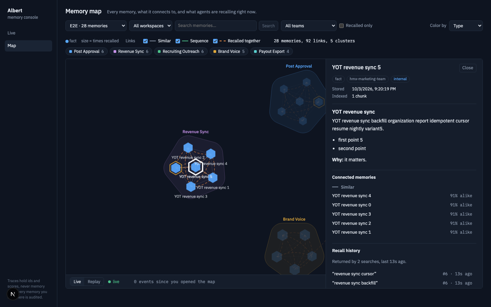
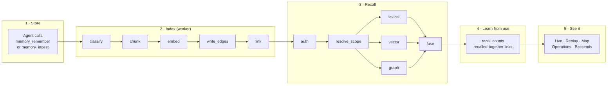
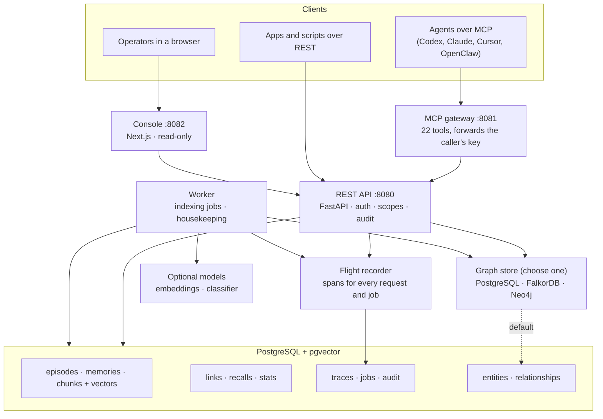
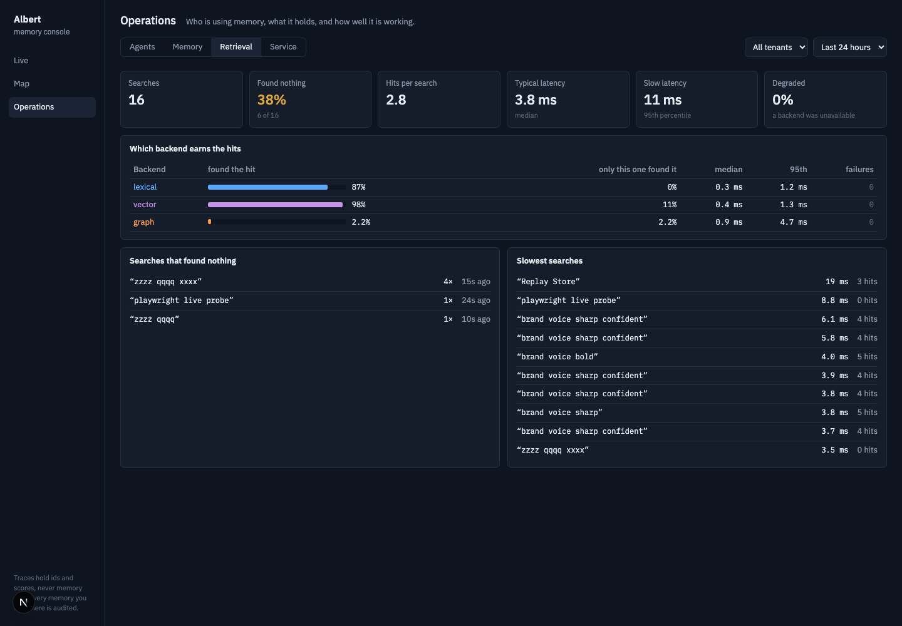
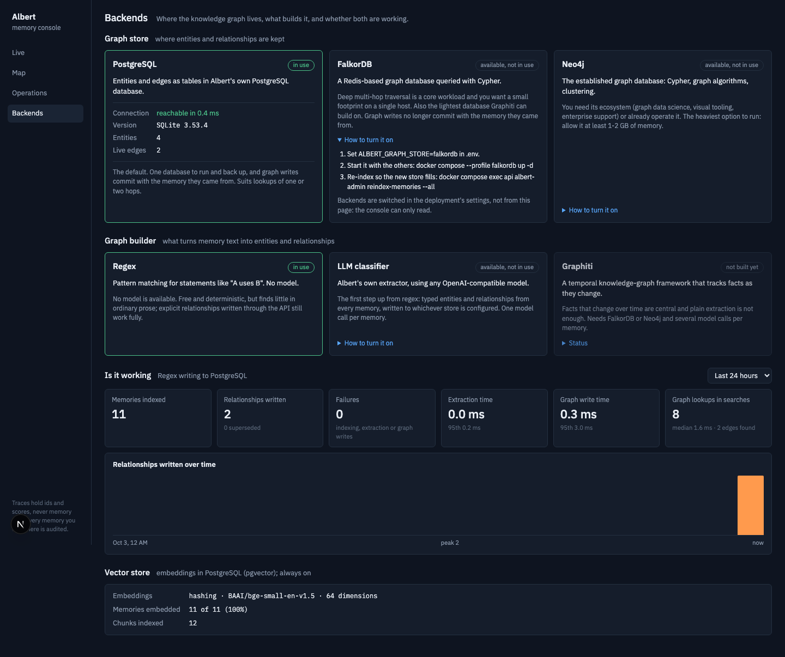

# Albert

**Memory for AI agents that you can actually watch think.**

Albert is a self-hosted memory service. Agents store what they learn, find it
again by meaning, by keyword and by relationship, and you get a live console
that shows every memory, how it connects to the others, and exactly why a
search returned what it did.



- **One service, any agent.** The same memory through REST and through 22 MCP
  tools. Codex, Claude, Cursor, OpenClaw or your own code all talk to it.
- **Three ways to find a memory, fused.** Full-text search, vector similarity
  and a knowledge graph each rank candidates; reciprocal-rank fusion merges
  them. If one backend is down, the others still answer and the response says so.
- **Nothing is a black box.** Every request and every background job is
  recorded step by step. Replay any search and see which backend found each
  hit and what it scored.
- **Yours.** PostgreSQL holds everything. Multi-tenant, capability-scoped API
  keys, sensitivity levels enforced on every path, audit trail, export and
  import. No vendor in the loop unless you choose a hosted model.

---

## The life of a memory

A memory goes through five stages. Each step below is a real span in Albert's
flight recorder, so you can watch every one of them in the console.



### 1. Store

An agent calls `memory_remember` (a fact it wants kept) or `memory_ingest` (a
whole document or transcript, kept as an *episode*). Albert checks the key's
capabilities, refuses anything that looks like a credential, writes the record
and queues it for indexing. The call returns immediately.

### 2. Index

The worker picks the job up and runs five steps:

| Step | What happens |
|---|---|
| `classify` | Labels the memory (fact, decision, procedure, warning and eight more) and its sensitivity, and extracts entities and relationships. A regex extractor by default; an LLM when you configure one. |
| `chunk` | Splits long text on paragraph boundaries so each piece gets its own embedding. |
| `embed` | Turns every chunk into a vector, stored in PostgreSQL with pgvector. |
| `write_edges` | Writes the extracted entities and relationships to the knowledge graph, and ends the validity of edges an edit made stale. |
| `link` | Connects the memory to its nearest neighbours (`similar`) and to the previous dated entry from the same folder (`sequence`). |

### 3. Recall

An agent calls `memory_search` or `memory_assemble_context`. After `auth` and
`resolve_scope` (which tenant, which workspace, which sensitivities this key may
see), three backends run:

| Backend | Finds memories by | Good at |
|---|---|---|
| `lexical` | PostgreSQL full-text search | Exact names, ids, error strings |
| `vector` | Cosine similarity over chunk embeddings | Same meaning, different words |
| `graph` | Entities and relationships matching the query | "What uses X?", "Who owns Y?" |

`fuse` merges the three rankings with reciprocal-rank fusion and returns the
top results, each labelled with the backends that found it.
`memory_assemble_context` goes one step further and returns a ready-to-use
block of text with citations, cut to a size you choose.

### 4. Learn from use

Every counted search teaches Albert something. A background pass turns search
traces into recall counts per memory and `recalled` links between memories that
keep being returned together. Memories that get used grow on the map; ones
that never do are easy to spot.

### 5. See it

The console shows all of it as it happens. See [the console](#the-console).

---

## Structure map



Where things live in the repository:

```text
src/albert/
  api.py              REST endpoints
  mcp_server.py       the 22 MCP tools
  services.py         storing, editing, forgetting, indexing
  classifier.py       regex and LLM classification and extraction
  chunking.py         paragraph-aware chunking
  embeddings.py       hashing, sentence-transformers, OpenAI-compatible
  search.py           lexical + vector + graph retrieval and fusion
  graph_store.py      the graph store interface and backend catalogue
  graph.py            PostgreSQL graph store
  graph_cypher.py     FalkorDB and Neo4j graph stores
  links.py            similar / sequence / recalled links, recall statistics
  clusters.py         cluster detection and naming for the map
  recorder.py         flight recorder (spans)
  trace_writer.py     off-thread trace persistence
  trace_feed.py       live trace stream
  console*.py         operator API: traces, map, operations, backends
  worker.py           job worker and housekeeping
  security.py         API keys, capabilities, sensitivity
  portability.py      export and import
  admin.py            albert-admin command line
console/              the operator console (Next.js)
migrations/           Alembic migrations 0001-0005
tests/                166 tests, including one contract run against every graph store
docs/                 guides (see below)
```

---

## The console

Five screens, all read-only, all fed by the flight recorder.

**Live** streams every request and job as it happens. **Replay** opens any one
of them as a waterfall of its steps, with the candidates each backend returned
and the fusion math behind the final ranking.

**Map** draws every memory as a node, linked to the ones it resembles, follows
or is recalled with, gathered into named clusters. Nodes pulse as agents recall
and store. Click one to read it in full.

**Operations** answers four questions: who is using memory, what does it hold,
are searches finding things, and is the service healthy.



**Backends** shows which graph store and graph builder are in use, proves they
are reachable and working, and gives the exact steps to switch.



---

## Choose your backends

PostgreSQL with embeddings is the baseline every install has. The rest is
configuration.

| Choice | Options | Setting |
|---|---|---|
| Embeddings | `hashing` (no download, for development), `sentence-transformers` (local), `openai-compatible` | `ALBERT_EMBEDDING_PROVIDER` |
| Graph builder | regex (no model), LLM classifier (any OpenAI-compatible model) | `ALBERT_LLM_PROVIDER` |
| Graph store | PostgreSQL (default), FalkorDB, Neo4j | `ALBERT_GRAPH_STORE` |

All three graph stores pass the same behavioural tests, run in CI against real
servers. Graphiti as a builder is planned, not built. Details and trade-offs:
[graph backends](docs/GRAPH_BACKENDS.md) and [providers](docs/PROVIDERS.md).

---

## Quick start

```bash
cp .env.example .env          # set ALBERT_POSTGRES_PASSWORD and ALBERT_API_KEY_PEPPER
docker compose up --build -d
```

Create the first tenant and administrator key (printed once; store it safely):

```bash
docker compose exec api albert-admin bootstrap \
  --organization "Example" --workspace "Default" --principal "Administrator"
```

Store a memory and find it again:

```bash
curl -H "Authorization: Bearer $ALBERT_API_KEY" -H "Content-Type: application/json" \
  -d '{"content": "The deploy script lives in ops/deploy.sh and needs VPN."}' \
  http://127.0.0.1:8080/v1/memories

curl -H "Authorization: Bearer $ALBERT_API_KEY" -H "Content-Type: application/json" \
  -d '{"query": "how do I deploy?"}' \
  http://127.0.0.1:8080/v1/search
```

| Service | Address |
|---|---|
| REST API and OpenAPI docs | `http://localhost:8080/docs` |
| MCP (streamable HTTP) | `http://localhost:8081/mcp` |
| Console | `http://localhost:8082` (after issuing it a key, see [deployment](docs/DEPLOYMENT.md)) |

Everything binds to loopback by default. Put it behind TLS before exposing it.

---

## What agents can do

The 22 MCP tools, each with a REST equivalent:

| Group | Tools |
|---|---|
| Remember | `memory_remember`, `memory_ingest`, `memory_update` |
| Recall | `memory_search`, `memory_assemble_context`, `memory_get`, `memory_get_episode` |
| Forget | `memory_forget`, `memory_forget_episode` |
| Knowledge graph | `memory_query_graph`, `memory_get_subgraph`, `memory_add_relationship` |
| Work in progress | `working_memory_start`, `working_memory_update`, `working_memory_get`, `working_memory_complete`, `working_memory_fail` |
| Coordination | `memory_lock_acquire`, `memory_lock_renew`, `memory_lock_release` |
| Portability | `memory_export`, `memory_import` |

---

## Documentation

| Read this | For |
|---|---|
| [Architecture](docs/ARCHITECTURE.md) | How Albert is built: data model, pipelines, settings |
| [Deployment](docs/DEPLOYMENT.md) | Running it, the console, backups, upgrades |
| [REST and MCP](docs/API_AND_MCP.md) | Endpoints, tools, capabilities, the console API |
| [Graph backends](docs/GRAPH_BACKENDS.md) | PostgreSQL, FalkorDB, Neo4j; regex, LLM, Graphiti |
| [Providers](docs/PROVIDERS.md) | Embedding and classification models |
| [Security](docs/SECURITY.md) | Keys, sensitivity, what the console can see |
| [Integration handbook](docs/integrations/README.md) | Connecting Codex, Claude, Cursor, OpenClaw, REST clients |
| [Status](docs/STATUS.md) | What is done, and what is not |

---

## Where it stands

Albert 0.4 is ready for self-hosted use on a private network: local installs,
internal deployments behind TLS, and controlled agent integrations with scoped
keys. It has not had an external security audit and is not a compliance-certified
public service; [status](docs/STATUS.md) lists what that would take.

Albert is a standalone system with its own infrastructure, credentials,
database and identity.
